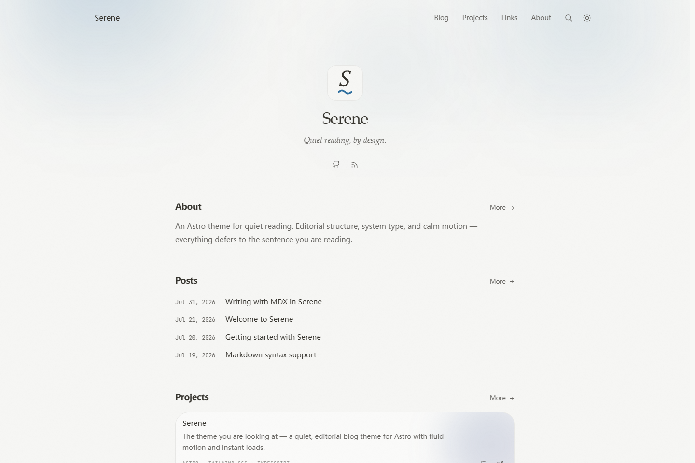
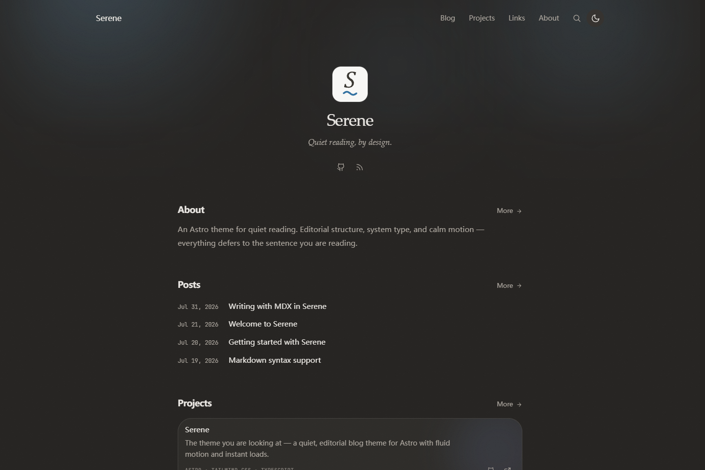
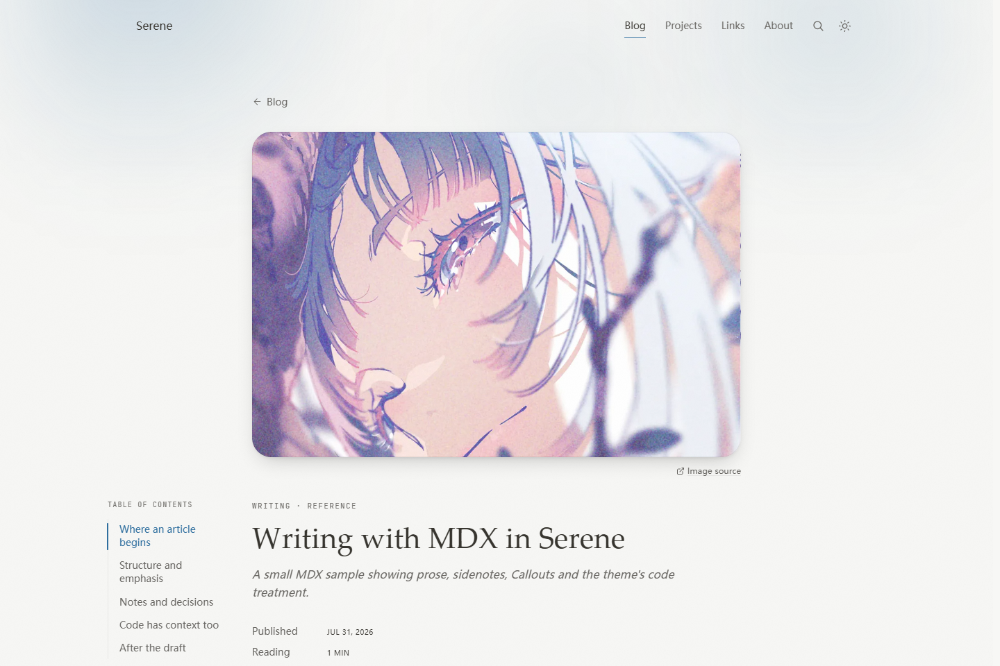

# Serene

[](https://astro.build) [](https://tailwindcss.com) [](https://github.com/yu030x/astro-theme-serene/deployments) [](LICENSE)

A quiet, editorial blog theme for **Astro**. It is static by default, uses system fonts, and keeps the reading column deliberately small.

English | [简体中文](./README.zh-CN.md) · **[Live demo →](https://astro-theme-serene.vercel.app)**



<details>
<summary>More screenshots</summary>




</details>

## Features

- Editorial blog pages with categories, tags, archive, RSS, sitemap, Open Graph and JSON-LD.
- Markdown and MDX support, including KaTeX math, sidenotes, syntax highlighting and Callouts.
- Reading-first details: table of contents, progress bar, image zoom, dark mode and reduced-motion support.
- Static search with Pagefind; Waline comments, reactions and GitHub contributions are optional.
- No required backend. Build `dist/` and deploy it to any static host.

## Deploy

[](https://vercel.com/new/clone?repository-url=https%3A%2F%2Fgithub.com%2Fyu030x%2Fastro-theme-serene)

## Quick start

Requires [Node.js](https://nodejs.org/) **22.12+**.

```bash
git clone https://github.com/yu030x/astro-theme-serene.git my-blog
cd my-blog
npm install
npm run dev       # http://localhost:4321
```

| Command | Purpose |
|---------|---------|
| `npm run dev` | Development server with hot reload |
| `npm run check` | Astro type and template diagnostics |
| `npm run build` | Static build plus Pagefind index |
| `npm run preview` | Preview the production build |

## Customize

Start with [`src/site.config.ts`](src/site.config.ts): site identity, author URL, navigation, social links, article license and optional integrations. Then replace the demo content in `src/content/blog/`, `src/data/projects.json`, `src/data/links.json` and `src/data/tools.json`.

`src/assets/tools/` ships a small set of icons to draw from; the `icon` field in `tools.json` takes any filename in that folder, and most of them are unused by the demo. Drop your own SVGs in alongside them.

UI copy is English and is not translated by `locale` — see [Localization](#localization).

Waline is disabled by default. Enable them only after adding your own server URL.


## Project structure

```text
astro-theme-serene/
├── .github/assets/      # README preview screenshots
├── public/              # Favicon, avatars, OG image and link icons
├── src/
│   ├── assets/          # Avatars, post images and tool icons
│   ├── components/      # Reusable UI
│   ├── content/blog/    # Markdown and MDX posts
│   ├── data/            # Projects, links and tools
│   ├── layouts/         # Page shells
│   ├── lib/             # Content, date and image helpers
│   ├── pages/           # Astro routes
│   ├── plugins/         # Markdown/MDX plugins
│   ├── scripts/app.ts   # Client interactions
│   ├── styles/global.css    # Tokens and component styles
│   ├── content.config.ts    # Content schema
│   └── site.config.ts   # Site settings
├── astro.config.ts      # Astro integrations and Vite setup
├── package.json         # Scripts and dependencies
├── tsconfig.json        # TypeScript configuration
├── CONTRIBUTING.md      # Contribution checks
└── LICENSE              # MIT license
```

## Contributing

Run `npm run check` and `npm run build` before opening a pull request. See [`CONTRIBUTING.md`](CONTRIBUTING.md) for the full checklist.

## Thanks

Inspired by [astro-theme-pure](https://github.com/cworld1/astro-theme-pure) and [Litos](https://github.com/Dnzzk2/Litos).

## License

[MIT](LICENSE)
